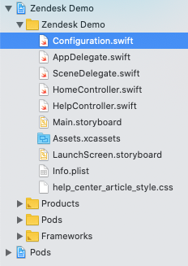
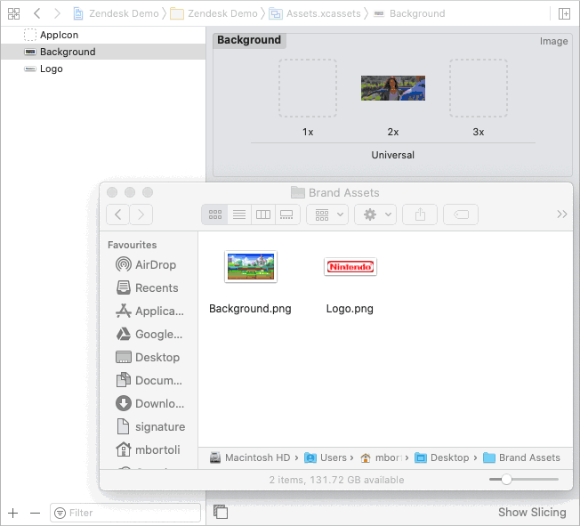

# Zendesk iOS Sample Mobile App (Messaging SDK)

This project is intended to show how the [Zendesk Mobile SDKs](https://developer.zendesk.com/documentation/zendesk-web-widget-sdks/sdks/ios/getting_started/) are integrated to an iOS app.

## REQUIREMENTS

- Xcode 11.4.X
- CocoaPods

## HOW TO USE

Download this project, uncompress it and follow the steps below.

### GETTING STARTED

- Make sure you have Xcode and CocoaPods installed on your computer
- If you don't have Xcode installed, you can find it for free in your App Store
- If you don't have CocoaPods, install it by running the following command on Terminal:
  ```console
  sudo gem install cocoapods
  ```

### CONFIGURATION

- Open the `Zendesk Demo.xcworkspace` file using Xcode
- On the left-side panel of Xcode, open the `Configuration.swift` file and change the following information.
  

#### FOR THE HOME SCREEN

```swift
// Configuration.swift

// Set your customer's website below
static var url = "https://www.zendesk.com"

// If you want to inject some extra customization (JavaScript) on your customer's website, add it below.
// If you don't want to inject any custom code, just leave the "script" var unchanged.
//
// PS: this is a local customization. It might be useful for demo purposes only.
static var script = """
                    // Custom code starts here

                    /* YOUR JAVASCRIPT CODE GOES HERE */

                    // Custom code ends here
                    """
```

FYI: If you don't want to inject any extra JavaScript code on the customer's website, just leave the `script` var unchanged. This is useful when you want to inject some extra information locally. For example, if you want to add a Zendesk Web Widget to their website, you would want to change it to:

```swift
static var script = """
                    // Custom code starts here

                    window.addEventListener('load', function() {
                      var url = 'https://static.zdassets.com/ekr/snippet.js?key=3798e302-522f-45c9-9ac6-xxxxxxxxxxx';

                      var script = document.createElement('script');
                      script.type = 'text/javascript';
                      script.id = 'ze-snippet';
                      script.src = url;

                      document.getElementsByTagName('head')[0].appendChild(script);
                    });

                    // Custom code ends here
                    """
```

#### FOR THE HELP SCREEN

```swift
// Configuration.swift

// IOS Messaging Channel Key
// You can find this information at https://{subdomain}.zendesk.com/admin/channels/messaging_and_social/channels_list
static var channelKey = "eyJzZXR0aW5xxxxxxxxxxxxxxxxmdzLzAxRlYyMzI5SE5NUUNKMDE5V0M0MDVCVEZOLmpzb24ifQ=="
```


#### CUSTOMIZING THE BRANDING

- Open the `Assets.xcassets` folder on the left-side panel of your Xcode project
- Click on "Background" and drag-and-drop a new background into the old 2x image
- Repeat the same process for the logo
  

FYI: For better results, use high-resolution images for both background and the logo. A PNG with a transparent background is also recommended for the logo. If you notice unwanted crop on the images or the logo being smaller than it should be, please use an image editor to make sure that your image doesn't have unwanted extra blank space on its surroundings.

### EXTRA OPTIONAL CUSTOMIZATION

If you want to [customize the look](https://developer.zendesk.com/embeddables/docs/ios_support_sdk/customize_the_look) of your help center, you can edit the file `help_center_article_styles.css`.

## IMPORTANT

Do not change any other file other than `Configuration.swift`, `help_center_article_styles.css`, or assets, unless you know what you're doing.

## CHANGELOG

### 2022-02-08
- First version released
- JWT Authentication
- Original Source: https://github.com/mdebortoli/zendesk-ios-sample-app


## AUTHOR
Original Author: [Marcelo De Bortoli](https://github.com/mdebortoli)